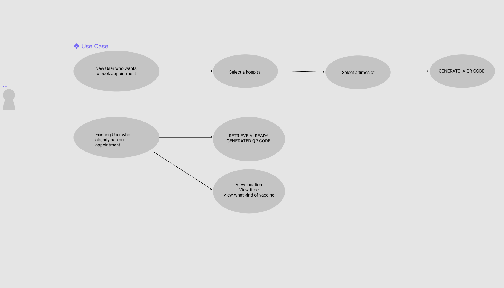

# BOOK MY APP
An iOS App that serves as a medium for people to book COVID vaccines from the comfort of their homes.

# APP DEMO  

# WHAT IT DOES 
We wanted to be apprehensive of the fact that the general masses are now getting vaccinated and we wanted to help more to this process. So we created BookMyVaccine.
The general features of this App are-
1. **BOOKING VACCINE SLOT** - With the medium of this App, Users can look for their nearest Hospitals, book the available time slots and select the type of vaccines they want and all this can be done with just a few clicks from this App.
2. **WIDGET** - We have incorporated Widgets too with the help of WidgetKit and we display the total number of people getting vaccinated in a specific country with the help of the widgets as we wanted to be optimistic of the fact that we are slowly defeating COVID-19.
3. **QR CODE** - Once the user is finished with booking his/her slot, we provide them with a QR code that is generately automatically with the help of their username.
4.  **DARK MODE AND LIGHT MODE** - We have implemented this App in both Dark and Light Mode and users can choose either of the two according to thier convinience.

# BUILDING THE APP 
**SYSTEM DESIGN**
We started our project with building the system design and started to brainstorm ideas in order to make our USE CASE DIAGRAMS AND THE WIREFRAMES.  
USE CASE DIAGRAM 
 
WIREFRAME 
 

# TECHNOLOGIES USED 
SWIFTUI,WIDGETKIT,NODE,MAPKIT

